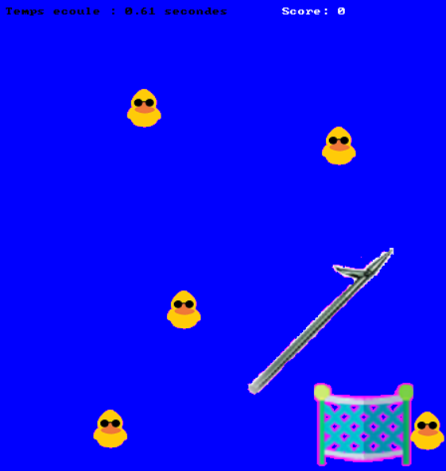
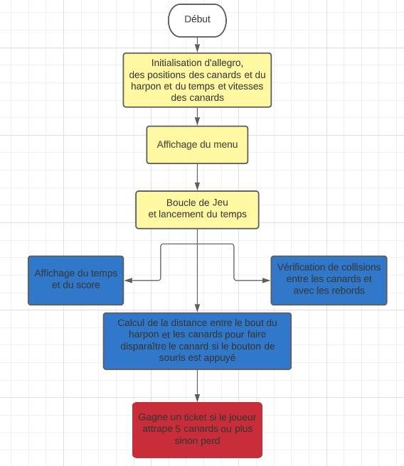
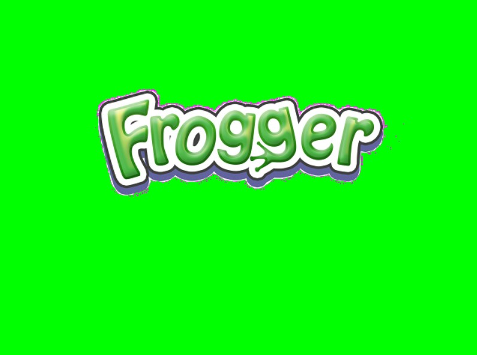
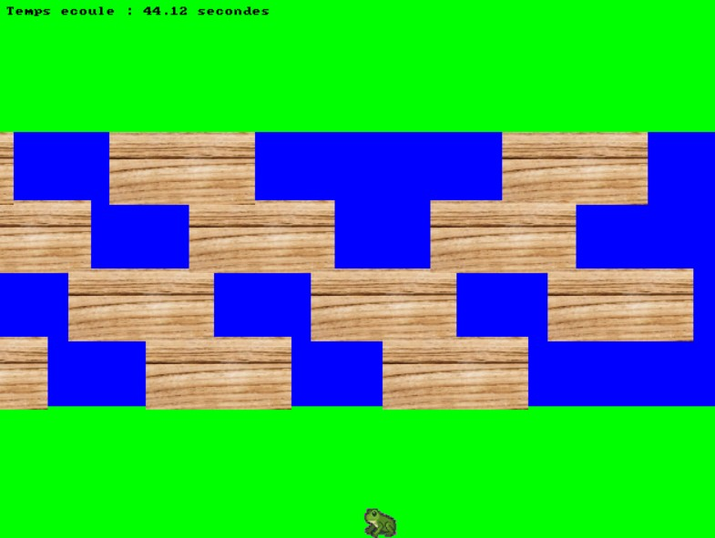
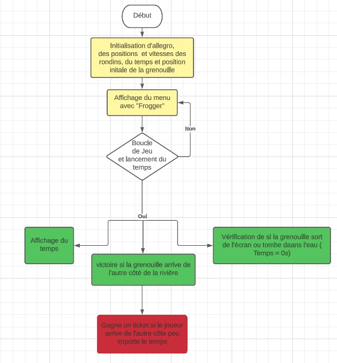
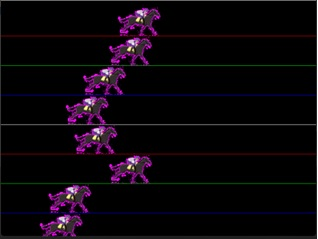
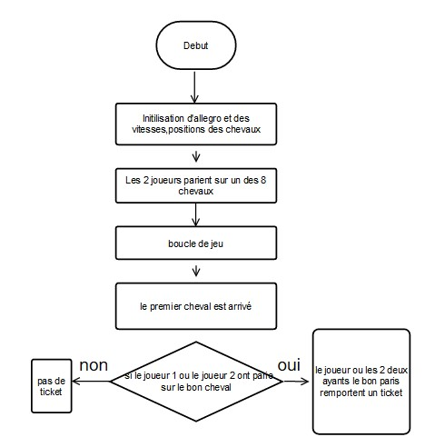
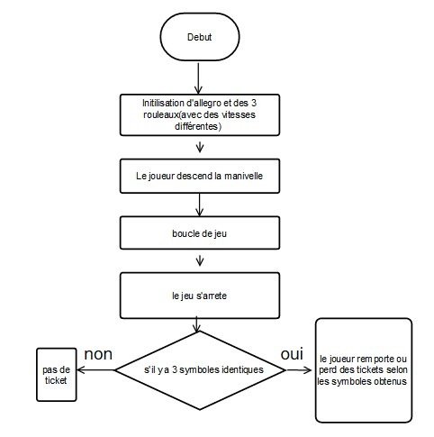

---
marp: true
theme: projet
paginate: true
_paginate: false
---
TD9
 Algorithmique Avancée et Bibliothèque Graphique - 2022-2023


**ING1** Projet d'informatique sur allegro 
# Un parc d'attraction 


# ECE World

Equipe 6

---

# Equipe 6


- Kinan LAKHDAR
- Kylian PINTO
- Reda  Hassani


---

# ECE World


## Thème

Le theme chosit par l'équipe est le casino car nous avons implémenté beaucoup de jeu en raport avec  celui-ci de plus ce projet se rapprochait  de celui-ci dans certaine règle nous avons trouvé cohérent de le choisir comme thème.

---

# Carte `1/2`

*Réalisée par : **Kinan**, **Tata**.*

Décrire ici les fonctionnalités implémentées : choix joueurs, saisie des noms, affichage des scores/classement... Comment avez-vous fait ? Quels étaient les problèmes rencontrés.

---

# Carte `2/2`

Suite si ça ne tient pas sur une slide. 

:bulb: *Vous pouvez faire comme ça à chaque fois qu'une slide ne suffit pas, il vaut mieux 5 slides légères qu'une surchargée.*

---

# Organisation des jeux

Précisez comment les jeux sont organisés ? Sont-ils dans des fichiers séparés ? Dans des dossiers ? Sont-ils éparpillés dans plusieurs fichiers ?

Quels paramètres prennent les jeux ?  La file d'événement par exemple ? Ou est-ce que chaque jeu crée sa propre file ?

Comment on lance un jeu et comment on revient à la carte à la fin de la partie ?
Comment le classement est-il mis à jour ?


---

# Pêche aux canards

Réalisé par : **Reda* (100%)

Décrire le fonctionnement du jeu dans les grandes lignes. Comment vous l'avez conçu.
- Les canards vont dans tous les sens avec une vitesse et direction aléatoire.
- Il faut attraper un maximum de canard dans le temps imparti qui est de 10 secondes.
- Les canards sont mis dans un filet lorsqu'ils sont attrapés.
- La collision des canards est détectée et quand deux canards se rencontrent ils partent dans des directions opposées.
- On attrape les canards grâce au bout du harpon.
- Menu avant de commencer le jeu ,on y accède avec Enter.


---



# Pêche aux canards
### Structures
    
    class Duck
    Duck : int x, y
    Duck : int vitesse
    Duck: int is_alive


### Tableaux

- `Duck ducks[10];`

---


# Pêche aux canards

### Graphe d'appel

    
    canardcollision --> changement_direction_canard
    murcollision --> changement_direction_canard
    main --> initialiserCanards
    initialiserCanards --> positionnerCanard
    main --> deplacerCanards
    main --> detecterCollisionCanards


---



# Pêche aux canards

### Logigramme


---
# Traversée de rivière 

Réalisé par : **Reda* (100%)*


- Le jeu débute lorsqu'on appuie sur ENTER.
- Il faut arriver de l'autre côte de la rivière avec la grenouille sans tomber dans l'eau .
- On perd si la grenouille est emportée avec un rondin.
- Le score est le temps fait et on gagne un ticket à partir du moment où on arrive de l'autre côté peu importe le temps.
- la grenouille reste sur le rondin lorsqu'elle est dessus 


---



# Traversée de rivière 


### Tableaux

- positions et vitesses des 12 bûches
`int log_x[12] = {0, 0, 0, 0, 0, 0, 0, 0, 0, 0, 0, 0};
    int log_y[12] = {120, 180, 240, 300, 120, 180, 240, 300, 120, 180, 240, 300, 120};
    int log_speed[12] = {0, 0, 0, 0, 0, 0, 0, 0, 0, 0, 0, 0};`

---



# Traversée de rivière 

### Graphe d'appel
<br>


    
    reste_sur_rondin --> est_sur_rondin
    initialiser_grenouille --> positionnergrenouille
    main --> initialisergrenouille
    main --> reste_sur_rondin
    main --> detecterCollisionCanards


---



# Traversée de rivière 

### Logigramme


---
# Snake 

Réalisé par : **Kinan* (100%)*


- Le jeu débute lorsqu'on appuie sur ENTER.
- Il faut arriver de l'autre côte de la rivière avec la grenouille sans tomber dans l'eau .
- On perd si la grenouille est emportée avec un rondin.
- Le score est le temps fait et on gagne un ticket à partir du moment où on arrive de l'autre côté peu importe le temps.
- la grenouille reste sur le rondin lorsqu'elle est dessus 


---


# Snake 


### Tableaux

- positions et vitesses des 12 bûches
`int log_x[12] = {0, 0, 0, 0, 0, 0, 0, 0, 0, 0, 0, 0};
    int log_y[12] = {120, 180, 240, 300, 120, 180, 240, 300, 120, 180, 240, 300, 120};
    int log_speed[12] = {0, 0, 0, 0, 0, 0, 0, 0, 0, 0, 0, 0};`

---


# Snake

### Graphe d'appel
<br>


    
    reste_sur_rondin --> est_sur_rondin
    initialiser_grenouille --> positionnergrenouille
    main --> initialisergrenouille
    main --> reste_sur_rondin
    main --> detecterCollisionCanards


---


# Snake 

### Logigramme


---


# Paris hippiques
*Réalisé par : **Kylian** (100%).*

- Les 2 joueurs parient l'un a la suite sur l'un des 8 chevaux
- La ligne de départ est en x=0 et l'arrivée à l'autre bout de l'écran
- Les chevaux vont à une vitesse différente (tirée aléatoirement).
- Si le joueur parie sur le bon cheval il remporte un ticket


---


# Paris hippiques

Voici les structures et les tableaux pour le mini jeu de paris hippiques 

### Structures
- `t_cheval Cheval : int x, y,BITMAP* droite[3],int direction,int frame,float vitesse,
int en_deplacement;`
    
### Tableaux

- `t_cheval cheval[8];`

---

# Paris hippiques

### Graphe d'appel

<br>

coursechevaux --> initialiserChevaux
    initialiserChevaux --> positionnerChevaux
    positionnerchevaux--> majchevaux
    majchevaux --> dessinerchevaux
    coursechevaux --> detecterarrivercanards


---


# Paris hippiques

### Logigramme


---

# Jakpot
*Réalisé par : **Kylian** (100%).*

- L'un des 2 joueurs descend la manivelle
- Les 3 rouleaux ont des vitesses différentes afin qu'on ne sache pas si on gagne à l'avance
- Si le joueur obtient trois symboles soit  il remporte un ticket soit il en perd en fonction des symboles répétés.


---


# Jakpot

Voici les structures et les tableaux pour le mini jeu jakpot 

### Structures
- `j'ai choisi de ne pas utiliser de stucture pour ce mini-jeu`
    
### Tableaux

- `les 3 rouleaux contenant les 3 bitmaps: BITMAP *bitmap[3];
BITMAP *bitmap2[3];
BITMAP *bitmap3[3];`

---

# Jakpot

### Graphe d'appel

<br>

    jackpot --> initialiserRouleau
    initialiserRouleau --> melangerordrebitmaps
    jakpot --> scrollbitmap(et arret des rouleaux)
    jakpot --> detectervictoire


---


# Jakpot

### Logigramme


---
# Bilan collectif
Ce projet fut très intérésssant tout d'abord car il a du etre réaliser en équipe ce qui suppose une confiance entre chacun des différents membres de plus ce projet nous a permis de découvrir plein de choses sur l'informatique et notamment de découvrir en profondeur ce qui peut se passer au sein du monde de l'informatique et notamment de découvrir le domaine du jeu vidéo.

---

<!--
_class: lead
-->

# Les slides suivantes ne seront pas présentées oralement lors de la soutenance mais doivent figurer dans la présentation. Nous les survolerons rapidement.

---

# Kinan

## Tâches réalisées (pour chaque membre de l'équipe)

- `✅ 100%` Tâche 1:
   - En effet la map a réussi à etre implementer
- `✅ 100%` Tâche 2
    - Le jeu difficile Snake a aussi été implémenter dans son intégralité
- `❌ 20%` Tâche 3
    - *Développer ici pourquoi cette tâche n'a pas été terminée.*
- `❌ 20%` Tâche 4
    - *Développer ici pourquoi cette tâche n'a pas été terminée.*
    - *Développer ici pourquoi cette tâche n'a pas été terminée.*

---
# Kylian

## Tâches réalisées (pour chaque membre de l'équipe)

- `✅ 100%` Tâche 1:
   - Le jeu moyen Jakpot a aussi été implémenter dans son intégralité
- `✅ 100%` Tâche 2
    - Le jeu moyen Paris hippiques  a aussi été implémenter dans son intégralité
- `❌ 20%` Tâche 3
    - *Développer ici pourquoi cette tâche n'a pas été terminée.*
- `❌ 20%` Tâche 4
    - *Développer ici pourquoi cette tâche n'a pas été terminée.*
    - *Développer ici pourquoi cette tâche n'a pas été terminée.*

---
# Reda

## Tâches réalisées (pour chaque membre de l'équipe)

- `✅ 100%` Tâche 1:
   - Le jeu moyen Traversée de rivière a aussi été implémenter dans son intégralité
- `✅ 100%` Tâche 2
    - Le jeu facile  Peche aux canards  a aussi été implémenter dans son intégralité
- `❌ 20%` Tâche 3
    - *Développer ici pourquoi cette tâche n'a pas été terminée.*
- `❌ 20%` Tâche 4
    - *Développer ici pourquoi cette tâche n'a pas été terminée.*
    - *Développer ici pourquoi cette tâche n'a pas été terminée.*

---

# Investissement

Nous pensons avoir travailler relativement equitablement ce qui pour nous nous donnerait les proportions suivantes:


 "Kylian" : 30%
"Reda" : 30%
"Kinan" : 40%

---

# Récapitulatif des jeux

| Jeu | Avancement | Problèmes / reste |
| --- | --- | --- |
| Pêche aux canards | 100% | - |
| Jakpot | 100% | - |
|Snake|100%|-|
|Paris hippiques|100%|-|
|Traversée de rivière|100%|-|


---

<!--
_class: lead
-->
# Quelques éléments que vous pouvez utiliser à votre guise dans votre présentation

---

# Schémas et Graphes

Vous pouvez utiliser [Mermaid.js](https://mermaid.js.org/) pour générer des schémas. Regardez la documentation.

---

# Slide avec du code


```C
for(int i = 0; i < 5; i++) {
    printf("%d ", i);
}
```

> 0 1 2 3 4 


---

# Emojis

https://gist.github.com/rxaviers/7360908

---

# Thème 

Vous pouvez personnaliser l'affichage de votre présentation avec le langage CSS en modifiant le fichier `theme.css`.

---

# Export PDF

Depuis récemment, l'export (**`Export Slide Deck...`**) en PDF oublie parfois des éléments. 
Si c'est le cas, nous vous conseillons d'exporter en fichier PowerPoint (pptx), puis de l'exporter en PDF depuis PowerPoint.